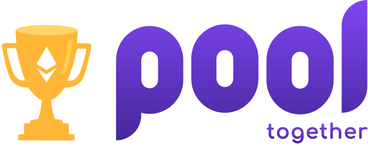

# Retroactive Public Goods Pooling

<div align="center" width="100%">
    
</div>
<br/>

This project is a tool that allows users to deposit and delegate their chances of winning to Optimism [RetroPGF](https://community.optimism.io/docs/governance/retropgf-2/) round 2 in one click gasless no loss donation; helping fund public goods that support the development and usage of the OP Stack

## Motivation
<div align="center">
    
</div>
<br/>
RetroPGF is Optimism mechanism for funding open-source software. The Optimism Collective’s second round of Retroactive Public Goods Funding (RetroPGF) takes place in Q1 2023.

This tool aims to simplify the stage of a user journey of depositing and delegating to RetroPGF in PoolTogether. While the PoolTogether frontend is extremely well designed 3, it is constrained by EOA wallets’ limitations. A user wanting to deposit and delegate to RetroPGF with an EOA has a multi-step process involving several transaction executions and two different web pages.

Harnessing the power PoolTogether as a no-loss saving protocol and CANDIDE account abstraction benefits to remove friction in participating in public goods funding.

## How it works

Users connect to the tool with their wallet using WalletConnect, and select the amount they want to deposit and delegate. They then get a request in their wallet to confirm the operations

## Main Contract Interaction

PoolTogether’s StakePrizePool and TWABDelegator on Optimism
Function Calls

The tool’s frontend communicates JSON-RPC method for sending multiple function calls from the user’s wallet. The tool offers a one-click experience for multi-step interactions of bundled calls that approve USDC, deposit to the pool and delegate the tickets to RetroPGF.eth. The standard for communication used is EIP-5792. The following function calls are communicated:

- `approve` X amount USDC ERC-20 contract

- `deposit` X amount USDC token to `StakePrizePool` contract

- `approve` X amount TICK ERC-20 contract

- `stake` with delegator address and X amount of TICK in `TWABDelegator` contract

- `createDelegation` with delegator address, slot number, delegatee address and lock duration in `TWABDelegator` contract

- `fundDelegation` with the delegator address, slot number, and amount of tickets in `TWABDelegator` contract

## Wallet compatibility

<div align="center">
    
</div>
<br/>

Smart contract wallets that support [EIP-5792](https://eips.ethereum.org/EIPS/eip-5792). EOA wallets like Metamask cannot execute bundled function calls

## Gas Sponsorship

Pooltogether is sponsoring the first 1000 deposits in support of retroactive public goods funding, making deposits gasless for end-users thanks to CANDIDE's [Paymaster feature](https://docs.candidewallet.com/develop/wallet/gas-sponsorship)

---

## Develop

```bash
npm install
npm run start
```

## Test

```bash
npm run test
```

## Build

```bash
npm run build
```
